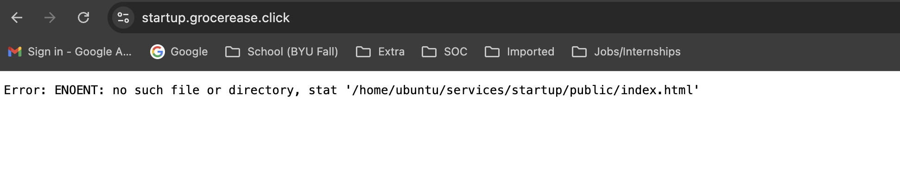
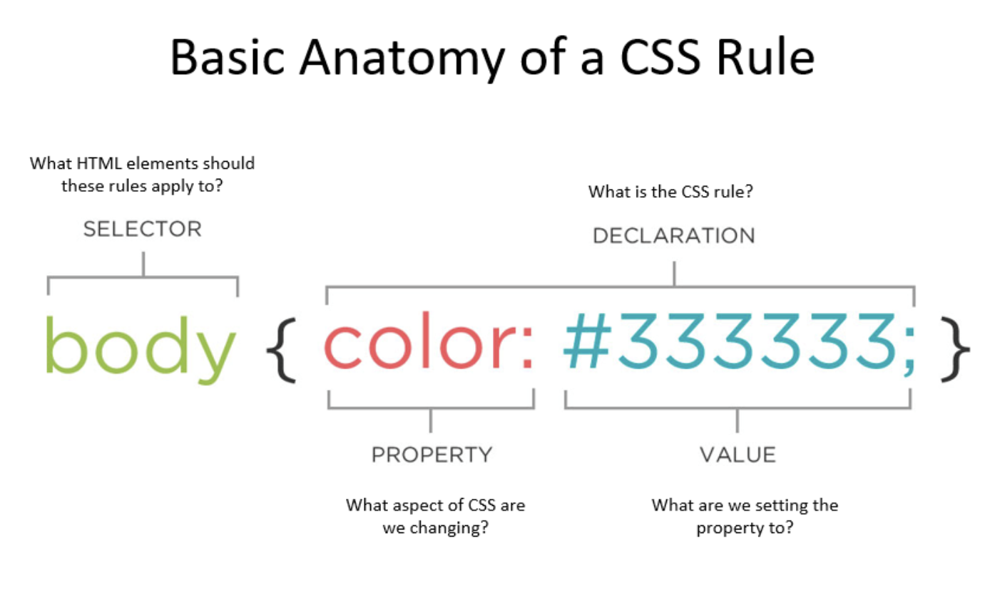

# CS 260 Notes

## 9/5/24 - Github


### Creating a Repository

To create a repository
- Select the respositories tab
- Click `New Repository`
- Fill out the repository details as desired


### Cloning a Repository

All GitHub repositories have a unique URL, which is what we use to clone, which includes all the commits, comments, and SHAs.

To clone a repository onto your device
- Get a copy of the URL by going to the repository and clicking the green `code` button, and then copying the HTTPS URL.
- Run the `git clone <url>` command in the terminal (verify you are in the right directory, this will create a subdirectory).


### Managing Changes

As you make changes to the repository (files, folders, etc.) you have to push the changes to the GitHub clone. Use the `git push` command.

To pull commits down, you will use the `git pull` command. A good order to follow is to pull changes, then make changes, then commit the changes, and push those changes to GitHub.


### Other Useful Commands

The `git fetch` command will give you the latest information about the changes on GitHub, without changing your local version.

The `git status` command will display the differences between the clones and show things such as missing commits.


### Handling Conflicts

Merge conflicts arise when the Github Code has changes, and you try to commit, push, or pull with different changes locally.

If the exact same line is changed, GitHub won't know what change to keep, so we cannot just pull the different commits. Run `git merge` to merge the changes. After the conflict is resolved, you can commit and push.


## 9/13/24 - Technology Stack

A technology stack is a "collection of technologies you use to create or deliver your web application." These normally layer on top of one another, which is where the term stack somes into play. The top of this stack is the web framework (such as React and Vue). This provides things such as authentication, business, data, storage, etc. by communicating with web services (which use backend services such as caching, DBs, logging, monitoring, etc.).

Migrating to a new stack is expensive and often causes problems and errors.


## 9/13/24 - Amazon Web Services-EC2

#### SSH into your server

To remote shell into your server, run the command:
```sh
ssh -i [key pair file] ubuntu@[ip address]
```

In there, there are a few different files.  
- The Caddyfile is the configuration file for your web service gateway.
- The public_html directory contains all of the static files that you are serving up directly through Caddy when using it as a web service
- The services directory is the place where you are going to install all of your web services once you build them.

Exit the remote shell by typing exit.


## 9/13/24 - Amazon Web Services-Route 53

- referring to a web server by its IP address works for development, but not for most users.
- you want to create a secure (HTTPS) connection to your app, which cannot be done with only an IP address. Use a domain name instead.
- Route 53 is the AWS service that handles everything DNS (Domain Name System) related. Can buy a domain name, host your domain on their DNS servers, and create DNS records with a DNS server.

#### Managing your DNS records

- DNS records map domain names to IP addresses (A records) or other domain names (CNAME records).
- There are two additional NS and SOA type records listed which are important for working with DNS.
    - The NS (name server) record contains the names of the authoritative name servers authorized by you to place DNS records in this DNS server. Listed with registrar you lease your domain name from. This way the authoritative NS can verify the DNS record and DNS registration match and are authorized to represent the domain name when defining DNS records.
    - The SOA (start of authority) record provides contact info about the owner of the domain name.


## 9/14/24 - Caddy

- Released in 2020 by Matt Holt, who combined building an HTTP server with Go with the ease of generating TLS certs with LetsEncrypt.
- Web service that listens for incoming HTTP requests. Then either serves up the requested static files or routes the request to another web service.
- Gateway or Reverse proxy: Ability to route requests and allows you to expose multiple web services as a single external web service.
- For this course, used for:
    - Handling all of the creation and rotation of web certs (we can easily support HTTPS)
    - Serves up all static HTML, CSS, and JS files.
    - Acts as gateway for subdomain requests to your startup app services.

#### Important Caddy Files

- Config file `/Caddyfile`
    - Contains definitions for routing HTTP requests that Caddy receives
    - Used to determine location where static HTML files are loaded from and to proxy requests into the services you create later.
    - You will only modify this file manually for when you configure your server's domain name.
- HTML files `/public_html`
    - Directory of files that Caddy serves up when requests are made to the root or your web server.
    - Configured in Caddyfile discussed above. Static file server is mapped to /usr/share/caddy.
    - Whenever Caddy receives an HTTP request for any domain name on port 80, it will use the path of the request to find corresponding files in this directory.


## 9/14/24 - HTTPS, TLS, and web certificates

#### HTTPS and TLS

- Secure version of HTTP is HTTPS (Secure Hypertext Transport Protocol)
- HTTPS is basically HTTP with a negotiated secure connection that happens before any data is exchanged.
- Secure connection means all data is encrypted using the TLS protocol.
    - How it works: negotiates a shared secret that is then used to encrypt data.
    - Can see its negotiation with `curl` along with the `-v` parameter to see the verbose output of the HTTPS exchange.
    - Negotiation involves multiple steps in the handshake.
    - Part of the handshake is the exchange of a web cert that identifies the domain name of the server creating the secure connection.
    - Browser compares the certificate domain name to the one represented in the URL. If no match, or expired cert, it will show a warning.

#### Web Certificates

- They are generated by a third party using public/private key encryption.
- Cert issuer is responsible for verifying that the cert owner actually owns the domain name represented by the cert.
- Once you have a cert from your web server, then the browser can validate cert using public keys of the cert issuer.
- `Let's Encrypt` was created by two Mozilla employees with the goal of creating trusted web certs for free.
    - Anyone with a domain name can dynamically generate and renew a cert for free.
- Caddy uses Let's Encrypt to generate a web cert every time an HTTPS request is made for a domain name Caddy doesn't have a cert for.
    1. Caddy asks Let's Encrypt to verify the domain for the requested cert is actually owned by the requester
    2. Let's encrypt tells the requester to return a specifically digitally signed response for a temporary URL when an HTTP request to the domain is made.
    3. Let's Encrypt then makes the HTTP request. If successful, issues cert to the requester.

#### To-Do: Enabling HTTPS

- Edit Caddy config file
```sh
vi Caddyfile
```
- Modified it to handle requests for my domain name.
- To save and exit the file, click `esc` then type `:wq`
- Restart Caddy so changes take effect.
```sh
sudo service caddy restart
```


## 9/19/24 - Hypertext Markup Language

- HTML provides the foundational content structure that all web apps build on.
- The concept of web pages were changed into web applications, where a new page represents either a single page application (SPA) or a large group of hyperlinked pages that form a multi-page application (MPA).

- text is valid HTML
- To provide structure to our text, we need to introduce the concept of elements and their associated tag representation.

#### Elements and tags

- HTML elements: represented with enclosing tags that may enclose other elements or text
    - Example: paragraph element and associated tag `p` designate that the text is a structural paragraph of text.
- Tags: refer to a delimited textual name that we use to designate the start and end of an HTML element as it appears in an HTML document.
    - Delimited with `<` and `>` symbols. Closing tags have a `/` before its name.
- `html` element represents the top level page structure.
- `head` element contains metadata about the page and page title.
- `body` element represents the content structure.
- `main` element represents the main content structure, as opposed to things such as headers, footers, asides, and navigation content.

#### Attributes

- HTML elements may have attributes
- Attributes: describe the specific details of the element.
    - Example: `id` attribute gives a unique ID to the element so that you can tell it apart from other elements.
    - Example: `class` attribute designates the element as being classified into a named group of elements.
- Attributes are written inside the element tag with a name followed by an optional value. (use single or double quotes)

#### Hyperlinks

- Represented with an anchor `a` element that has an attribute containing the address of the hyperlink reference `href`.
```html
<a href="https://byu.edu">Go to the Y</a>
```

#### Complete Example

- HTML defines a header `<!DOCTYPE html>` that tells the browser the type and version of the document.

#### Common Elements

| element | meaning |
| ------- | ------- |
| `html`  | The page container |
| `head`  | Header information |
| `title` | Title of the page  |
| `meta`  | Metadata for the page such as character set or viewport settings|
| `script`  | JavaScript reference. Either a external reference, or inline |
| `include` | External content reference |
| `body`    | The entire content body of the page |
| `header`  | Header of the main content |
| `footer`  | Footer of the main content |
| `nav`     | Navigational inputs |
| `main`    | Main content of the page |
| `section` | A section of the main content |
| `aside`   | Aside content from the main content |
| `div`     | A block division of content |
| `span`    | An inline span of content |
| `h<1-9>`  | Text heading. From h1, the highest level, down to h9, the lowest level |
| `p`       | A paragraph of text |
| `b`       | Bring attention |
| `table`   | Table |
| `tr`      | Table row |
| `th`      | Table header |
| `td`      | Table data |
| `ol,ul`   | Ordered or unordered list |
| `li`      | List item |
| `a`       | Anchor the text to a hyperlink |
| `img`     | Graphical image reference |
| `dialog`  | Interactive component such as a confirmation |
| `form`    | A collection of user input |
| `input`   | User input field |
| `audio`   | Audio content |
| `video`   | Video content |
| `svg`     | Scalable vector graphic content |
| `iframe`  | Inline frame of another HTML page |

#### Comments

Can include comments by starting it with `<!--` and ending it with `-->`

#### Special Characters

HTML uses several reserved characters for defining its file format. If you want to use those characters in your content, then escape them using the entity syntax.
- Example: to display a less than symbol `<` you would instead use the less than entity `&lt;`
- Entity syntax can also be used to represent any unicode character.

| Character | Entity      |
| --------- | ----------- |
| &amp;     | `&amp;`     |
| <         | `&lt;`      |
| >         | `&gt;`      |
| "         | `&quot;`    |
| '         | `&apos;`    |
| &#128512; | `&#128512;` |

#### HTML Versions

Different featuress and when they were introduced helps you know what has been around for a long time and is supported by more browsers, and what is new and may not work everywhere.

| Year | Version | Features                                  |
| ---- | ------- | ----------------------------------------- |
| 1990 | HTML1   | format tags                               |
| 1995 | HTML2   | tables, internationalization              |
| 1997 | HTML3   | MathML, CSS, frame tags                   |
| 1999 | HTML4   | external CSS                              |
| 2014 | HTML5   | email, password, media, and semantic tags |

#### index.html

A default web server will display the HTML file named index.html when a web browser, such as Google Chrome, makes a request without asking for a specific HTML file.


## HTML structure elements

- two major purposes of HTML is to provide structure and content to your web app.
- common html structural elements are: body, header, footer, main, section, aside, p, table, ol/ul, div, and span.

#### Block and Inline

- There is a distinction between structure elements that are block vs inline.
- Block element is meant to be a distinct block in the flow of the content structure.
- Inline element is meant to be inline with the content flow of a block element. 
    - AKA, they do not disrupt the flow of a block element's content


## 9/20/24 - HTML input elements

There are different elements for accepting the input of user data.

| Element    | Meaning                          | Example                                        |
| ---------- | -------------------------------- | ---------------------------------------------- |
| `form`     | Input container and submission   | `<form action="form.html" method="post">`      |
| `fieldset` | Labeled input grouping           | `<fieldset> ... </fieldset>`                   |
| `input`    | Multiple types of user input     | `<input type="" />`                            |
| `select`   | Selection dropdown               | `<select><option>1</option></select>`          |
| `optgroup` | Grouped selection dropdown       | `<optgroup><option>1</option></optgroup>`      |
| `option`   | Selection option                 | `<option selected>option2</option>`            |
| `textarea` | Multiline text input             | `<textarea></textarea>`                        |
| `label`    | Individual input label           | `<label for="range">Range: </label>`           |
| `output`   | Output of input                  | `<output for="range">0</output>`               |
| `meter`    | Display value with a known range | `<meter min="0" max="100" value="50"></meter>` |

#### Form element

- Main purpose of the `form` element is to submit the values of the inputs it contains.
- With JavaScript we have much more control over the input data and what is done with it.
    - For example, in a single page application the JavaScript with dynamically rebuild the HTML elements to reflect the result of the user interaction.
    - Form example that submits the value of a textarea element:
```html
<form action="submission.html" method="post">
  <label for="ta">TextArea: </label>
  <textarea id="ta" name="ta-id">
Some text
  </textarea>
  <button type="submit">Submit</button>
</form>
```

#### Input element

Input element represents many different input types. Set the type of input with the `type` attribute. 

| Type           | Meaning                           |
| -------------- | --------------------------------- |
| text           | Single line textual value         |
| password       | Obscured password                 |
| email          | Email address                     |
| tel            | Telephone number                  |
| url            | URL address                       |
| number         | Numerical value                   |
| checkbox       | Inclusive selection               |
| radio          | Exclusive selection               |
| range          | Range limited number              |
| date           | Year, month, day                  |
| datetime-local | Date and time                     |
| month          | Year, month                       |
| week           | Week of year                      |
| color          | Color                             |
| file           | Local file                        |
| submit         | button to trigger form submission |

#### Validating input

Several input elements have validation built into them. They will not accept a value that is not for example, a number, a URL, outside of a range, or an email address.

You can specify the required attribute on an input element to mark it as requiring a value before it can be submitted.

The `pattern` attribute exists on `text`, `search`, `url`, `tel`, `email`, and `password` inputs.


## HTML media elements

HTML elements that represent media are: img, audio, video, svg, and canvas.
- img, audio, and video elements reference to an external file
- svg and canvas both contain code to render a visual image that can be animated.

### External media

Media tags that reference external media all take a URL as an attribute. The path represented by the URL can either be a relative path or full path. (full includes the protocol, domain name, and path to file)

### Internal media

Internal media elements, svg and canvas, allow you to actually create images directly within your HTML.

#### Scalable Vector Graphics (SVG)

SVG is an extremely powerful and widely supported way to render graphics inline in your HTML.

#### Canvas

The canvas element was introducted to HTML in order to facilitate 2D drawing and animation.


## Deploy to production

- deploy to your production environment using the deployFiles.sh script found in the example app.
    - The script does three things: deletes any previous deployment for simon, copies up all of the files found in the project directory, and makes sure Caddy is hosting the files under the simon subdomain of your domain.

```sh
./deployFiles.sh -k ../<folder>/<yourpemkey> -h <yourdomain.click> -s simon
```


## Startup html

- Make sure to add the `deployFiles.sh` file to the src folder with the html files, or you get an error like below:


- To move out of more than one directory, use additional `../` like below:

```sh
./deployFiles.sh -k ../../<folder>/<yourpemkey> -h grocerease.click -s startup
```

- Some things I want to note to implement:
    - Design it so if a user isn't authenticated, index.html will redirect them to login.html
    - Database will contain login data to tell if a user is authenticated


# CSS

## Cascading Style Sheets

- converts structure and content of HTML into a vibrant and responsive design and overall experience.
- nowadays, css focuses more on helping the developer create complex renderings of dynamic content that is responsive to the actions of the user and device the application is rendered on.
- With CSS a web programmer can:
    - animate the page
    - deploy custom fonts
    - respond to user actions
    - dynamically alter the entire layout of the page based on device size and orientation
- CSS is primarily defines rulesets or just simply rules. A rule is comprised of a selector that selects the elements to apply the rule to, and one or more declarations that represent the property to style with the given property value.

- There are three ways to use CSS with HTML
    1. use the style attribute of an HTML element and explicitly assigne one or more declarations
    2. use the HTML style element to define CSS rules within the HTML document (in the head element of the document)
    3. use the HTML link element to create a hypelink reference to an external file containing CSS rules. Link must appear in the head element of the document.
- element's inherit rules applied to parents, but also the rules cascade down from the highest nodes in the DOM tree to the lowest level. Lower level declarations override higher declarations.

### The box model

- CSS defines everything as boxes, so when you apply styles you are actually applying them to a region of the display that is a rectangular box.
- There are several internal boxes within an element's box.
- Innermost box holds element's content (text, image, etc)
- Next box is padding, which will inherity things like the background color.
- Then there is the border (color, thickness, line style)
- Finally, the last box is the margin, which represents white space as it is considered external to the actual styling of the box.

- by default, the width and height of an element is defined by the width and height of the content box. 
    - change the `box-sizing` CSS property from the default value of the `content-box` to `border-box` in order to redefine the width and height to also include padding and border.

### CSS versions


| Year      | Version | Features   |
| --------- | ------- | ------------------------- |
| 1996      | CSS1    | selectors, font, color, background, alignment, margin, border, padding  |
| 1998      | CSS2    | positioning, z-index, bidirectional text, shadows  |
| 2011      | CSS2.1  | removed incompatible features  |
| 1999-2021 | CSS3    | enhancements for media, box, background, borders, color, template, multi-column, selectors |


## CSS Selectors

### Element type selector

element name selector, such as `body` element to apply style to all the children of the body (whole document)
- there is a wildcard element name selector `*` to select all elements

### Combinators

a descendant combinator is defined with a space delimited list of values where each item in the list is a descendant of the previous.
- Example: a selector that would be all `h2` elements that are descendants of `section` elements
    ```css
    section h2 {
        color: #004400;
    } 
    ```
Some other types of combinators:
| Combinator       | Meaning   | Example        | Description    |
| ---------------- | -------- | -----------| ---------- |
| Descendant       | A list of descendants      | `body section` | Any section that is a descendant of a body |
| Child            | A list of direct children  | `section > p`  | Any p that is a direct child of a section  |
| General sibling  | A list of siblings         | `div ~ p`      | Any p that has a div sibling               |
| Adjacent sibling | A list of adjacent sibling | `div + p`      | Any p that has an adjacent div sibling     |

We can use the general sibling combinator to increase the whitespace padding on the left of paragraphs that are siblings of a level two heading.

### Class selector

Any element can have zero or more classifications applied to it.

Supply class name summary prefixed with a period such as:
```css
.summary {
    font-weight: bold;
}
```
You can also combine the element name and class selectors to select all paragraphs with a class of summary.
```css
p.summary {
    font-weight: bold;
}
```

### ID selector

All IDs should be unique within an HTML document and so this select targets a specific element. To use the ID selector you prefix the ID with the hash symbol `(#)`.
```css
#physics {
    border-left: solid 1em purple;
}
```

### Attribute selector

You use an attribute selector to select any element with a given attribute (`a[href]`). You can also specify a required value for an attribute (`a[href="./fish.png"]`) in order for the selector to match. 

Attribute selectors also support wildcards such as the ability to select attribute values containing specific text (`p[href*="https://"]`).

```css
p[class='summary'] {
    color: red;
}
```

### Pseudo selector

CSS also defines a significant list of pseudo selectors which select based on positional relationships, mouse interactions, hyperlink visitation states, and attributes.

Example: we want our purple highlight bar to appear only when the mouse hovers over the text. To accomplish this we can change our ID selector to select whenever a section is hovered over.
```css
section:hover {
    border-left: solid 1em purple;
}
```


## CSS Declarations

CSS rule declarations specify a property and value to assign when the rule selector matches one or more elements.

| Property           | Value                              | Example             | Discussion                                                                     |
| ------------------ | ---------------------------------- | ------------------- | ------------------------------------------------------------------------------ |
| background-color   | color                              | `red`               | Fill the background color                                                      |
| border             | color width style                  | `#fad solid medium` | Sets the border using shorthand where any or all of the values may be provided |
| border-radius      | unit                               | `50%`               | The size of the border radius                                                  |
| box-shadow         | x-offset y-offset blu-radius color | `2px 2px 2px gray`  | Creates a shadow                                                               |
| columns            | number                             | `3`                 | Number of textual columns                                                      |
| column-rule        | color width style                  | `solid thin black`  | Sets the border used between columns using border shorthand                    |
| color              | color                              | `rgb(128, 0, 0)`    | Sets the text color                                                            |
| cursor             | type                               | `grab`              | Sets the cursor to display when hovering over the element                      |
| display            | type                               | `none`              | Defines how to display the element and its children                            |
| filter             | filter-function                    | `grayscale(30%)`    | Applies a visual filter                                                        |
| float              | direction                          | `right`             | Places the element to the left or right in the flow                            |
| flex               |                                    |                     | Flex layout. Used for responsive design                                        |
| font               | family size style                  | `Arial 1.2em bold`  | Defines the text font using shorthand                                          |
| grid               |                                    |                     | Grid layout. Used for responsive design                                        |
| height             | unit                               | `.25em`             | Sets the height of the box                                                     |
| margin             | unit                               | `5px 5px 0 0`       | Sets the margin spacing                                                        |
| max-[width/height] | unit                               | `20%`               | Restricts the width or height to no more than the unit                         |
| min-[width/height] | unit                               | `10vh`              | Restricts the width or height to no less than the unit                         |
| opacity            | number                             | `.9`                | Sets how opaque the element is                                                 |
| overflow           | [visible/hidden/scroll/auto]       | `scroll`            | Defines what happens when the content does not fix in its box                  |
| position           | [static/relative/absolute/sticky]  | `absolute`          | Defines how the element is positioned in the document                          |
| padding            | unit                               | `1em 2em`           | Sets the padding spacing                                                       |
| left               | unit                               | `10rem`             | The horizontal value of a positioned element                                   |
| text-align         | [start/end/center/justify]         | `end`               | Defines how the text is aligned in the element                                 |
| top                | unit                               | `50px`              | The vertical value of a positioned element                                     |
| transform          | transform-function                 | `rotate(0.5turn)`   | Applies a transformation to the element                                        |
| width              | unit                               | `25vmin`            | Sets the width of the box                                                      |
| z-index            | number                             | `100`               | Controls the positioning of the element on the z axis                          |


### Units

- You can use a variety of units when defining size of a CSS property

| Unit | Description                                                      |
| ---- | ---------------------------------------------------------------- |
| px   | The number of pixels                                             |
| pt   | The number of points (1/72 of an inch)                           |
| in   | The number of inches                                             |
| cm   | The number of centimeters                                        |
| %    | A percentage of the parent element                               |
| em   | A multiplier of the width of the letter `m` in the parent's font |
| rem  | A multiplier of the width of the letter `m` in the root's font   |
| ex   | A multiplier of the height of the element's font                 |
| vw   | A percentage of the viewport's width                             |
| vh   | A percentage of the viewport's height                            |
| vmin | A percentage of the viewport's smaller dimension                 |
| vmax | A percentage of the viewport's larger dimension                  |

### Color

| Method       | Example                   | Description                                                                                                                                                                                                       |
| ------------ | ------------------------- | ----------------------------------------------------------------------------------------------------------------------------------------------------------------------------------------------------------------- |
| keyword      | `red`                     | A set of predefined colors (e.g. white, cornflowerblue, darkslateblue)                                                                                                                                            |
| RGB hex      | `#00FFAA22` or `#0FA2`    | Red, green, and blue as a hexadecimal number, with an optional alpha opacity                                                                                                                                      |
| RGB function | `rgb(128, 255, 128, 0.5)` | Red, green, and blue as a percentage or number between 0 and 255, with an optional alpha opacity percentage                                                                                                       |
| HSL          | `hsl(180, 30%, 90%, 0.5)` | Hue, saturation, and light, with an optional opacity percentage. Hue is the position on the 365 degree color wheel (red is 0 and 255). Saturation is how gray the color is, and light is how bright the color is. |


## CSS Fonts

### Font families

There are four major families of fonts: `Serif`, `sans-serif`, `fixed`, and `symbol`. 
- A serif is a small stroke attached to the ends of a character's major strokes.
- Serif fonts have the extra strokes; sans-serif fonts do not.
- Fixed fonts characters all are the same size. This is useful for lining up text when doing things like coding or displaying tabular data.
- Symbol fonts represent non-language characters such as arrows or emojis.

### Importing fonts

You can specify a font that you provide with your application. That way your application is guaranteed to always look the same. In order to have the browser load a font you use the @font-face rule and provide the font name and source location.
```css
@font-face {
  font-family: 'Quicksand';
  src: url('https://cs260.click/fonts/quicksand.ttf');
}

p {
  font-family: Quicksand;
}
```


## CSS Animation

You create CSS animations using the `animation` properties and defining `keyframes` for what the element should look like at different times in the animation.


## Responsive Design

Responsive design is the ability to configure the interface so the application accommodates and takes advantage of the screen's size and orientation.

### Display

- CSS display property allows you to change how an element is displayed by the browser.

| Value  | Meaning    |
| ------ | ------------------- |
| none   | Don't display this element. The element still exists, but the browser will not render it.                                    |
| block  | Display this element with a width that fills its parent element. A `p` or `div` element has block display by default.        |
| inline | Display this element with a width that is only as big as its content. A `b` or `span` element has inline display by default. |
| flex   | Display this element's children in a flexible orientation.     |
| grid   | Display this element's children in a grid orientation.  |

- By default, `div` elements have a displahy property value of `block`.

### Viewport meta tag

Mobile browsers auto started scaling websites so they look better on a small screen, but as web apps started being responsive to screen size, the scaling would get in the way.

- Solution is to include a meta tag in the `head` element of your HTML pages. This tells your browser to not scale the page.

```html
<meta name="viewport" content="width=device-width,initial-scale=1" />
```

### Float

The float CSS property moves an element to the left or right of its container element and allows inlihne elements to wrap around it.

### Media queries

One of the main CSS features for creating responsive applications is the `@media` selector. This dynamically detects the size and orientatio of the device and applies CSS rules to represent the structure of HTML in a way that accommodates the change.

- Example: to see if the screen is in portrait mode or not:
    ```css
    @media (orientation: portrait) {
        div {
        transform: rotate(270deg);
        }
        aside {
            display: none;
        }
    }
    ```


## CSS Grid

- The grid display layout is useful when you want to display a group of child elements in a responsive grid.
- We turn this into a responsive grid by including a CSS display property with the value of grid on the container element. (This tells the browser that all of the children of this element are to be displayed in a grid flow.)
- The grid-template-columns property specifies the layout of the grid columns. We set this to repeatedly define each column to auto-fill the parent element's width with children that are resized to a minimum of 300 pixels and a maximum of one equal fractional unit (1fr) of the parents total width.
- Next, we fix the height of the rows to be exactly 300 pixels by specifying the grid-auto-rows property.
- Finally, we finish off the grid configuration by setting the grid-gap property to have a gap of at least 1 em between each grid item.

```css
.container {
  display: grid;
  grid-template-columns: repeat(auto-fill, minmax(300px, 1fr));
  grid-auto-rows: 300px;
  grid-gap: 1em;
}
```


## CSS Flexbox

The `flex` display layout is useful when you want to partition your application into areas that responsively move around as the window resizes or orientation changes.

To get the division of space for the flexbox children correct we add the following flex properties to each of the children.
- header - flex: 0 80px - Zero means it will not grow and 80px means it has a starting basis height of 80 pixels. This creates a fixed size box.
- footer - flex: 0 30px - Like the header it will not grow and has a height of 30 pixels.
- main - flex: 1 - One means it will get one fractional unit of growth, and since it is the only child with a non-zero growth value, it will get all the remaining space. We want it to also be a flexbox container for the controls and content area. So we set its display to be flex and specify the flex-direction to be row so that the children are oriented side by side.


## CSS Frameworks

CSS frameworks provide functions and components that commonly appear in web apps. When apps begin to use the same patterns over and over, these patterns were combined into a shared package of code and are now open source repos.

They decrease the time to develop an app and create a common user experience for the web overall.

### Tailwind

Tailwind takes a different approach than traditional CSS frameworks, using smaller definitions that are applied specifically to individual HTML elements (rather than using large, rich, CSS rulesets).
- This moves a lot of the CSS representation out of the CSS file and into the HTML.

Example:
```html
<div class="pt-6 md:p-8 text-center md:text-left space-y-4">
  
  <p class="text-lg font-medium">“Tailwind CSS”</p>
</div>
```

### Bootstrap

Most popular framework by far. Has a lot of lessons learned from real world apps.
- Major downside is it's success. Because it is so popular, it defines the de facto look and feel of websites. This is good for user experience, but it makes it harder to grab new user attention.

To integrate bootstrap into a web app, you need to reference the Bootstrap CSS files from their CDN (content delivery network). Then add the html link elements to your head element. Example below.

```html
<!DOCTYPE html>
<html lang="en">
  <head>
    <meta name="viewport" content="width=device-width, initial-scale=1" />
    <link
      href="https://cdn.jsdelivr.net/npm/bootstrap@5.2.3/dist/css/bootstrap.min.css"
      rel="stylesheet"
      integrity="sha384-rbsA2VBKQhggwzxH7pPCaAqO46MgnOM80zW1RWuH61DGLwZJEdK2Kadq2F9CUG65"
      crossorigin="anonymous"
    />
  </head>
  <body>
    ...
  </body>
</html>
```

If you are planning to include Bootstrap's components that require JS, you will need to include the Bootstrap JS module. Put the following at the end of your HTML body element to do so.

```html
<body>
  ...

  <script
    src="https://cdn.jsdelivr.net/npm/bootstrap@5.2.3/dist/js/bootstrap.bundle.min.js"
    integrity="sha384-kenU1KFdBIe4zVF0s0G1M5b4hcpxyD9F7jL+jjXkk+Q2h455rYXK/7HAuoJl+0I4"
    crossorigin="anonymous"
  ></script>
</body>
```

To include bootstrap in your app using NPM, run the following from your console

```sh
npm install bootstrap@5.2.3
```

#### Using bootstrap

Once bootstrap is linked in your html files, you can use the components it provides. You change the class to a bootstrap specific class. In the example below, the `btn` class gives the button a nice looking rounded appearance, and the `btn-primary` class shades the button with the current primary color for the app (default is blue).

```html
<button type="button" class="btn btn-primary">Bootstrap</button>
```


# JavaScript

## Introduction

Officially known as EXMAScript, it is a weakly typed languages based on concepts found in C, Java, and Scheme.
- Most used programming language in the world, running on every browser and commonly used as a web server language and for creating serverless functions.
- Typically it is executed using an interpreter at runtime instead of compiling it into a machine specific binary at build time.
    - This makes JS very portable, but also allows for a lot of errors, such as using an undefined variable (errors normally only get discovered when the program crashes during an execution)

### Getting Started

JavaScript's runtime's built in function `console.log` outputs the string to the debugger console.

### Comments

you can make comments with block or line comments

### Code delimiters

Not required, but suggested, to end JS statements with a semicolon `;`. Code block and their scope are defined with curly braces `{ }`.

