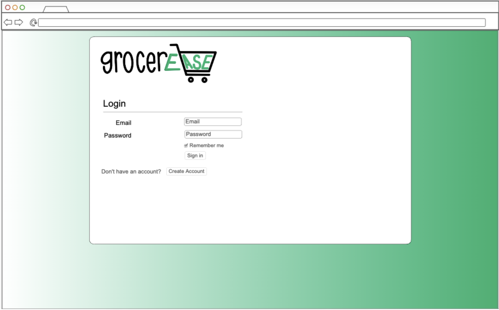
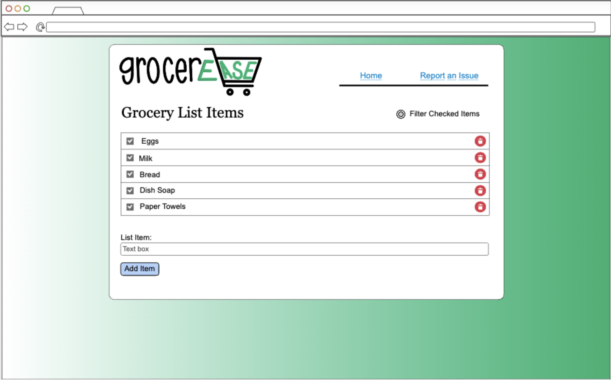

# grocerease

## Elevator Pitch

Have you ever had a conflict with your roommates over forgetting an item when grocery shopping, or ever wanted to help your roommates with their own grocery shopping? Sending a bunch of texts a day containing items you or the apartment needs can get hard to keep track of, as those texts get lost in a sea of other messages. The application “grocerease” streamlines the process of having an up to date, and organized grocery list available for you and your roommates. As each roommate adds items to the list, deletes an item, or checks one off, these updates are displayed in realtime for the other roommates! Keep track of your list, and easily add items as they come to mind with grocerease.

## Design

The application's Login page:

The application's Register page:

The application's Main page:

## Usage of Different Technologies

- **HTML** - Utilizes the proper HTML structure throughout the entire app. There will be three HTML pages, one for logging in, one for creating an account, and one for viewing and adding grocery list items.
- **CSS** - Styles the application so it is visually appealing with appropriate spacing and color themes, while also offering a responsive design.
- **JavaScript** - Allows the user to interact with the application and add grocery list items to the list by pressing a button.
- **React** - Manages and provides login, shows grocery list items added from anyone in the group, lets users add more list items, uses React management features.
- **Service** - Backend service with endpoints for:
    - Login
    - Retrieving grocery list items
    - Adding grocery list items
- **DB/Login** - Store current users and their added items in the database. Users will have a group associated with their account, and hashed password also stored in the database. Will be used to login and register users, and unless authenticated will not be able to view the website.
- **WebSocket** - Adds real time updates as each user adds items, their addition is shown to all other users in their group.

## HTML Usage Specifics

For this deliverable, I set up the framework of my application using HTML.

- **HTML pages**: Three HTML pages, one for logging in, creating an account, and one for viewing and adding list items.
- **Links**: After successfully authenticating, the login page will automatically link to the grocery list.
- **Text**: Describes each grocery list item by title added with it.
- **Images**: The application’s logo is a png image displayed on each page.
- **DB/Login**: Includes text input fields for user username and password, as well as a submit button for signing in and creating an account. The displayed grocery list items will be pulled from the database.
- **WebSocket**: The grocery list items and their checked status are updated and managed in realtime.

## CSS Usage Specifics

For this deliverable, I applied the final styles to the application, giving it its finished look.

- **Header, footer, and main content body**: Maintain a consistent appearance across all pages including login and registration pages. Includes proper alignment and spacing, and as more items are added the main content body will grow until scrolling is required.
- **Navigation elements**: Simple yet satisfying design for best user experiences.
- **Responsive design**: Utilize media queries to ensure a clean and consistent display on all windows and devices.
- **Application elements**: Utilize contrasting colors to verify easy to read material, and use appropriate whitespace that is visually satisfying.
- **Application text content**: Use consistent text size and fonts for visual appeal and consistency.
- **Application images**: The logo image fits well and looks like it belongs with proper margins.

## JavaScript Usage Specifics

For this deliverable, I used JavaScript in order to add dynamic features and implement the necessary logic used in the application.

- **Event and Error Handling**: Utilize and implement JavaScript functions to handle error messages and user interactions such as adding list items and clicking the login button.
- **Dynamic Content**: Utilize JavaScript to update content dynamically, such as displaying items just added to the list.
- **Backend Calls**: Use fetch calls to interact with backend endpoint calls for login and retrieving list items.

## React Usage Specifics

For this deliverable, I utilized React to create an interactive user interface and handle the application state.

- **Components**: Login, registration, grocery list
    - **Login Component**: Handles user authentication, taking users to the grocery list page after they login.
    - **Registration Component**: Handles user account creation, redirecting them to the login page after successfully creating an account.
    - **Database Component**: Displays the grocery list items.

## Service Usage Specifics

For this deliverable, the backend endpoints handle incoming list items and return the updated lists, overall supporting the functionality of the application as a whole.

- **Backend service endpoints**: Authenticates and manages user sessions, stored on the server. New users who register are securely stored on the server. Retrieves and manages list items and updates to the list.
- **API Frontend**: Utilize HTTP methods such as GET, POST, PUT, and DELETE to interact with the frontend.

## Database/Login Usage Specifics

For this deliverable, I utilize the database for user authentication and link grocery list items to the user, which are also stored in the database.

- **Database**: Will utilize MongoDB Atlas to store user data and grocery list items.
- **User Registration**: New account is created in the database if a user successfully registers.
- **Current Users**: User sessions are managed, passwords are securely stored, and user grocery list items are stored.
- **Access Control**: Cannot view the website or any associated pages or data until successfully authenticated.

## WebSocket Usage Specifics

For this deliverable, I used WebSocket to make real time updates for the grocery list items and their status.

- **WebSocket Connection**: The backend will listen for the WebSocket connection, and the frontend will make that connection.
- **Realtime Data Display**: User grocery list items will be updated in realtime, as they are added, deleted, and checked. The filtering checked items option will be by device, not stored or updated among other devices.